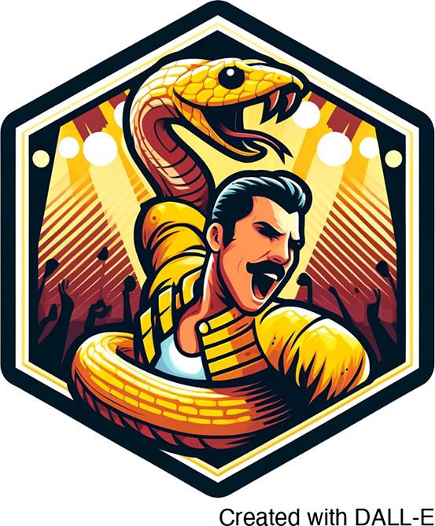

# ReptilianRhapsody



A snakemake workflow for running the BD Rhapsody Sequence Analysis Pipeline on multiple samples in 
parallel.

## Input and configuring the pipeline

To configure the pipeline following config files have to be edited or created:

**config/config.yml**

reference: Specify path to reference file to use for Rhapsody pipeline
threads: The number of threads to use per submitted job
bigmem_partition: Slurm partition to use for memory heavy jobs. Needs to allow at least 128G memory
for 24h

**config/samples.tsv**

A simple text file listing ids for all sample to be processed. No header line and one sample per
line. Optional second tab-delimited column containing number of cells, which should be extracted for
each sample. See existing file for example.

**config/read_files.tsv**

A tab-delimited table listing all input fastq files for all sample, one file per line. Contains a
header line with column names (sample, file). This allows providing multiple input files per sample
on multiple lines. See exisiting file for example.

## Running the pipeline
To run the pipeline after setting up the configuration files run the following command:

```
snakemake --use-conda -j1 -n  # '-n' performs a dry run, remove to run pipeline
```

This will run the workflow for all specified samples locally. Snakemake can submit jobs to an HPC
cluster via slurm, which is the recommended way of running the pipeline. See
[snakemake documentation](https://snakemake.readthedocs.io/en/v7.32.0/executing/cluster.html) for
more information. The preferred way of running snakemake workflows on a cluster is by using profiles
specifying cluster parameters.

```
snakemake --use-conda --profile <profile name> -j1 -n  # '-n' performs a dry run, remove to run pipeline
```
